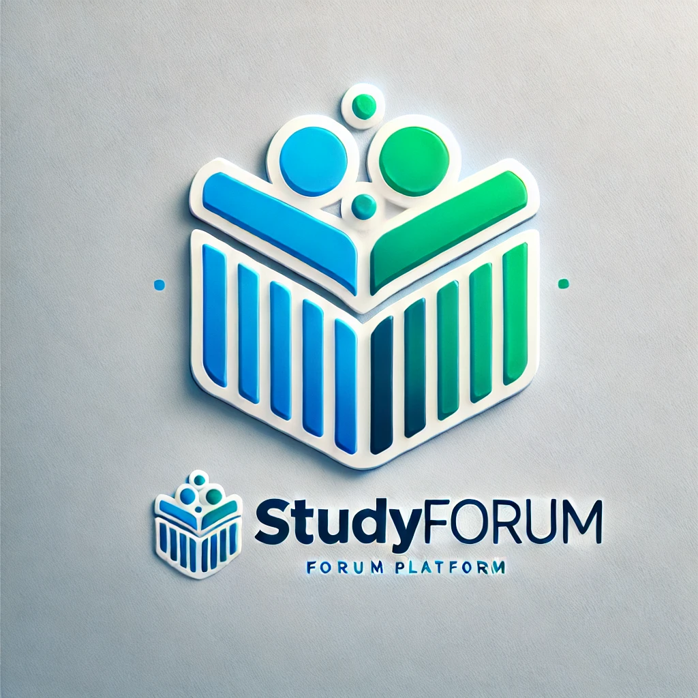

<a name="readme-top"></a>
<div align="center">
<a href="https://github.com/Lukapeng77/Forum_Project">
     
  </a>

<h3 align="center">CVWO Forum Project</h3>
  <p align="left">
  A fullstack forum project serves as a peer-to-peer academic support platform that ensures college students to toggle roles between tutors and tutees to ask and answer academic questions, empowering them with personalized, real-time learning experiences beyond traditional learning mode. Furthermore, the platform enables students to make appointments with corresponding tutors for online or face-to-face meetings, built with the following tech skills: Go, PostgreSQL, Vite, React, and Tailwind CSS.
  </p>
</div>

<!-- TABLE OF CONTENTS -->
<details>
  <summary>Table of Contents</summary>
  <ol>
    <li>
      <a href="#about-the-project">About The Project</a>
        <li><a href="#tech-skills">Tech Skills<a></li>
    </li>
    <li>
      <a href="#getting-started">Getting Started</a>
        <li><a href="#prerequisites">Prerequisites</a></li>
        <li><a href="#installation">Installation</a></li>
    </li>
    <li><a href="#use-cases">Use cases</a></li>
  </ol>
</details>
<!-- ABOUT THE PROJECT -->

### About the Project 

To help students get more personalized academic assistance, the forum project is deisgned for them to better communicate and support each other. On this platform, students can either be tutors or tutees, and they can switch roles seamlessly. If students need academic teaching help, they can post questions for specific modules on the platform and seek tutors under this corresponding post. 

<p align="right">(<a href="#readme-top">back to top</a>)</p>

### Tech Skills 

- [Go](https://go.dev/)
- [PostgreSQL](https://www.postgresql.org/)
- [Vite](https://vitejs.dev/)
- [React](https://reactjs.org/)
- [TypeScript](https://www.typescriptlang.org/)
- [TailwindCSS](https://tailwindcss.com/)

<p align="right">(<a href="#readme-top">back to top</a>)</p>

<!-- GETTING STARTED -->

### Getting Started

This project is an online forum platform, showcasing the integration of modern web technologies. The frontend is built with Vite, React, TypeScript, and Tailwind CSS, offering a responsive and dynamic user interface. The backend is powered by Go with a PostgreSQL database, ensuring efficient data handling and scalability. Here's the guideline to set up and run the project on your local machine for development and testing.

### Prerequisites

Before you begin, ensure you have the following prerequisites installed:

-   [Node.js](https://nodejs.org/en/download/)
-   [Go](https://go.dev/dl/)
-   [PostgreSQL](https://www.postgresql.org/)
-   [NPM](https://www.npmjs.com/)

### Installation

1. **Clone the Repo**
   Clone the repository to your local machine:
    ```sh
    git clone https://github.com/Lukapeng77/Forum_Project.git
    ```
2. FrontEnd Setup:
   Navigate to the frontend directory and install the dependencies:
    ```sh
    cd frontend
    npm install
    ```
3. Run the file:
    ```sh
    npm run dev
    ```
4. BackEnd Setup:
   In a separate terminal, navigate to the back-end directory. Install Go dependencies:
    ```sh
    cd backend
    go mod tidy
    ```
5. Database Setup:
   Ensure PostgreSQL is running. To create schema and populate with fake data.
    ```sh
    make build
    make migrate
    make seed
    ```
6. .env file Setup:
   Create a .env file under backend directory, set below env variables properly:
    ```sh
    Postgresql_URI=<your_Postgresql_uri>
    PORT=5000
    ENV=development
    
    ```
7. FrontEnd: Run the Vite development server:
    ```sh
    cd frontend
    npm run dev
    ```
8. Backend: Start up server after schema has be created and populated
    ```sh
    cd backend
    make run
    ```
9. Go to http://localhost:5001/, the website should be hosted on your local device.

<p align="right">(<a href="#readme-top">back to top</a>)</p>

<!-- USAGE EXAMPLES -->

### Use Cases 

## 1. Peer-to-Peer Academic Support
- Facilitate a collaborative platform where students can post or answer questions about specific academic modules. 
- Empower students to seamlessly toggle between the roles of tutors and tutees, enabling dynamic learning and teaching experiences.

## 2. Faculty Involvement
- Enable professors and teaching assistants to actively engage in student discussions.
- Provide corrections, clarifications, and additional explanations to ensure the accuracy of information and enhance learning outcomes.

## 3. Real-Time Communication
- Support real-time user interactions through integrated chat rooms and instant messaging features.
- Allow students to seek immediate academic assistance and foster collaborative learning.

<p align="right">(<a href="#readme-top">back to top</a>)</p>

<!-- MARKDOWN LINKS & IMAGES -->

[React.js]: https://img.shields.io/badge/React-20232A?style=for-the-badge&logo=react&logoColor=61DAFB
[React-url]: https://reactjs.org/
[NPM]: https://img.shields.io/badge/npm-CB3837?style=for-the-badge&logo=npm&logoColor=white
[NPM-url]: https://www.npmjs.com/
[TailwindCSS]: https://img.shields.io/badge/tailwindcss-%2338B2AC.svg?style=for-the-badge&logo=tailwind-css&logoColor=white
[TailwindCSS-url]: https://v2.tailwindcss.com/docs
[Vite]: https://img.shields.io/badge/vite-%23646CFF.svg?style=for-the-badge&logo=vite&logoColor=white
[Vite-url]: https://vitejs.dev/
[Go]: https://img.shields.io/badge/Go-00ADD8?style=for-the-badge&logo=go&logoColor=white
[Go-url]: https://go.dev/
[ReactRouter]: https://img.shields.io/badge/React_Router-CA4245?style=for-the-badge&logo=react-router&logoColor=white
[ReactRouter-url]: https://reactrouter.com/en/main
[PostgreSQL]: https://img.shields.io/badge/PostgreSQL-316192?style=for-the-badge&logo=postgresql&logoColor=white
[PostgreSQL-url]: https://www.postgresql.org/
[TypeScript]: https://img.shields.io/badge/TypeScript-007ACC?style=for-the-badge&logo=typescript&logoColor=white
[TypeScript-url]: https://www.typescriptlang.org/
